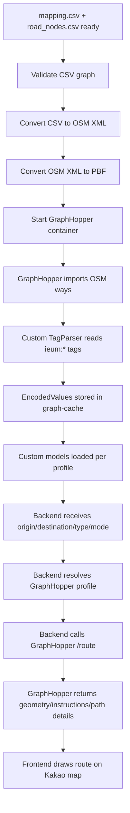

# 07 GraphHopper Common Flow

> Created: 2026-05-03  
> Purpose: Keep the GraphHopper verification goal, current state, and next tasks reusable across sessions.

## File Variables

Use these aliases throughout this plan. Update this section first when the source files change.

| Alias | Current file | Meaning |
|---|---|---|
| `mapping.csv` | `etl/raw/gangseo_road_segments_mapping_v2.csv` | Segment CSV with accessibility attributes mapped onto the routing graph |
| `road_segments.csv` | `etl/raw/gangseo_road_segments_v8.csv` | Base segment topology before attribute mapping |
| `road_nodes.csv` | `etl/raw/gangseo_road_nodes_v8.csv` | Node topology for `mapping.csv` / `road_segments.csv` |
| `mapping_report.json` | `runtime/etl/gangseo-v6-attribute-mapping/report_v2.json` | Attribute mapping report |

## Goal

Convert the Gangseo pedestrian graph into a GraphHopper-routable graph, store accessibility attributes as GraphHopper encoded values, route by user/profile-specific custom models, and draw the result on Kakao map.



## Current State

Done:

- `mapping.csv` generated from `road_segments.csv`.
- `mapping.csv` row count: `46,036`.
- Segment types: `SIDE_LINE=44,120`, `SIDE_WALK=1,916`.
- `mapping_report.json` generated.
- Gap overlay now uses `mapping.csv`.
- 3001 gap overlay API verified.
- In-app browser verified: Kakao SDK/fetch console errors are `0`.
- Crosswalk signal and audio signal matching radius is `20m` in EPSG:5179 meter space.
- CSV graph validation report generated: `runtime/graphhopper/validation/gangseo_v2_v8_report.json`.
- OSM XML converter implemented: `graphhopper/scripts/csv_to_osm.py`.
- OSM XML generated: `graphhopper/data/gangseo.osm`.
- OSM conversion report generated: `runtime/graphhopper/osm/gangseo_osm_report.json`.
- PBF build script implemented: `graphhopper/scripts/build_pbf.sh`.
- PBF build report generated: `runtime/graphhopper/pbf/gangseo_pbf_report.json`.
- PBF generated: `graphhopper/data/gangseo.osm.pbf`.
- PBF sanity check passed with `osmium fileinfo`.
- GraphHopper custom EV/TagParser Maven module implemented under `graphhopper-plugin/`.
- GraphHopper runtime config now loads `mapping.csv` attributes through `ieum:*` encoded values.
- Docker GraphHopper build now compiles the plugin, copies `gangseo.osm.pbf`, and starts the custom GraphHopper application.
- Local JVM import smoke passed: `/health` returned `OK`, `/info` listed the custom encoded values, and graph-cache files were created under `runtime/graphhopper/import-smoke/graph-cache`.
- Docker GraphHopper smoke passed: container is healthy, `/health` returned `OK`, `/info` listed custom encoded values, and import logs show `46,036` ways accepted.
- Profile route behavior smoke passed and saved to `runtime/graphhopper/route-smoke/gangseo_profile_behavior_report.json`.
- Backend `/api/v1/routes/search` integration smoke passed and saved to `runtime/backend/route-smoke/backend_graphhopper_route_report.json`.
- Gap overlay route verification UI implemented in `etl/gangseo_mapping_gap_overlay_map.html`.
- Gap overlay route proxy implemented at `POST /api/gangseo-route-search` on the 3001 overlay API.
- In-app browser route overlay smoke passed: 2 compare routes rendered and Kakao/fetch console errors were `0`.
- Gap overlay proxy API compare smoke passed: `VISUAL` and `MOBILITY` both returned distinct SAFE vs SHORTEST geometry hashes.

Current stage:

```mermaid
flowchart LR
  A["1. Attribute mapping"] --> B["2. CSV graph validation"]
  B --> C["3. OSM XML generation"]
  C --> D["4. PBF generation"]
  D --> E["5. GraphHopper import + EV"]
  E --> F["6. Backend route API"]
  F --> G["7. Kakao route overlay"]

  A:::done
  B:::done
  C:::done
  D:::done
  E:::done
  F:::done
  G:::done

  classDef done fill:#dcfce7,stroke:#16a34a,color:#14532d
  classDef next fill:#fef9c3,stroke:#ca8a04,color:#713f12
  classDef todo fill:#f3f4f6,stroke:#9ca3af,color:#374151
```



## Implementation Checklist

Every implementation result for this flow should include this checklist, with the current status and the next concrete task.

Status legend:

- `[x]` done
- `[~]` in progress or implemented but not fully accepted
- `[ ]` not started
- `[!]` blocked

Checklist:

| Status | Step | Acceptance signal | Current note |
|---|---|---|---|
| `[x]` | 1. CSV graph validation 실행 | validation script exits successfully | `runtime/graphhopper/validation/gangseo_v2_v8_report.json` generated |
| `[x]` | 2. validation report 확인 | no hard blockers remain | duplicate node-pair and component warnings accepted as routing quality risks |
| `[x]` | 3. `csv_to_osm.py` 구현 | OSM XML converter test passes | `graphhopper/scripts/csv_to_osm.py` implemented |
| `[x]` | 4. OSM XML/PBF 생성 | `gangseo.osm` and `gangseo.osm.pbf` exist and pass sanity checks | `osmium fileinfo` passed |
| `[x]` | 5. GraphHopper custom EV/TagParser 구현 | `/info` exposes custom encoded values after import | Docker smoke passed |
| `[x]` | 6. custom model 작성 | profiles load and route behavior differs by profile | route behavior smoke passed |
| `[x]` | 7. 백엔드 `/route` 연동 | backend maps user type/mode to profile and returns GraphHopper route | Docker backend smoke passed |
| `[x]` | 8. Kakao 지도 route overlay 구현 | frontend draws returned route geometry on Kakao map | gap overlay UI/proxy smoke passed |

Current next task:

- Expand OD scenario QA and refine route comparison UX if needed.

## Runtime Profile Mapping

Backend request fields should map to GraphHopper profiles like this:

| User type | Mode | GraphHopper profile |
|---|---|---|
| `VISUAL` | `SAFE` | `visual_safe` |
| `VISUAL` | `SHORTEST` | `visual_fast` |
| `MOBILITY` | `SAFE` | `wheelchair_manual_safe` |
| `MOBILITY` | `SHORTEST` | `wheelchair_manual_fast` |

Do not expose GraphHopper profile names directly as public API enums.

## OSM Tag Contract

`csv_to_osm.py` should write attributes from `mapping.csv` directly as OSM way tags. The custom GraphHopper `TagParser` should read these tags from `ReaderWay`.

| `mapping.csv` column | OSM way tag | GraphHopper encoded value |
|---|---|---|
| `edgeId` | `ieum:edge_id` | mapping artifact or path-detail strategy |
| `walkAccess` | `ieum:walk_access` | `walk_access` |
| `avgSlopePercent` | `ieum:avg_slope_percent` | `avg_slope_percent` |
| `widthMeter` | `ieum:width_meter` | `width_meter` |
| `brailleBlockState` | `ieum:braille_block_state` | `braille_block_state` |
| `audioSignalState` | `ieum:audio_signal_state` | `audio_signal_state` |
| `slopeState` | `ieum:slope_state` | `slope_state` |
| `widthState` | `ieum:width_state` | `width_state` |
| `surfaceState` | `ieum:surface_state` | `surface_state` |
| `stairsState` | `ieum:stairs_state` | `stairs_state` |
| `signalState` | `ieum:signal_state` | `signal_state` |
| `segmentType` | `ieum:segment_type` | `segment_type` |

Recommended base OSM way tags:

- `highway=footway`
- `foot=yes`
- `oneway=no`
- `source=mapping.csv`

## Remaining Work

### 1. CSV Graph Validation

Status: done.

Run:

```bash
python graphhopper/scripts/validate_csv_graph.py \
  --segments etl/raw/gangseo_road_segments_mapping_v2.csv \
  --nodes etl/raw/gangseo_road_nodes_v8.csv \
  --report-json runtime/graphhopper/validation/gangseo_v2_v8_report.json
```

Check:

- required columns
- enum violations
- bad node references
- bad geometries
- endpoint mismatches
- duplicate edge IDs
- duplicate node-pair edges
- self loops
- connected component quality

Latest result:

- segments: `46,036`
- nodes: `47,489`
- hard blockers: none
- duplicate node-pair edges: `471`
- connected components: `5,152`
- largest component edge ratio: `0.322378`

Accepted risk for next step:

- Duplicate node-pair edges and high component count do not block OSM XML generation, but they are routing quality risks. Recheck profile smoke routes against these connectivity limits.

### 2. CSV to OSM XML/PBF

Status: done.

Implement:

- `graphhopper/scripts/csv_to_osm.py` done.
- `graphhopper/scripts/build_pbf.sh` done.

Acceptance:

- OSM XML contains all usable nodes and ways.
- Every way has `ieum:edge_id`.
- Every way has expected `ieum:*` accessibility tags.
- PBF generation is deterministic.

Latest OSM XML result:

- output: `graphhopper/data/gangseo.osm`
- source nodes: `47,489`
- source segments: `46,036`
- OSM nodes: `73,594`
- OSM ways: `46,036`
- synthetic shape nodes: `26,105`
- ways missing `ieum:edge_id` or `highway=footway`: `0`

Latest PBF result:

- output: `graphhopper/data/gangseo.osm.pbf`
- report: `runtime/graphhopper/pbf/gangseo_pbf_report.json`
- input OSM XML size: `43,856,732` bytes
- output PBF size: `990,092` bytes
- `osmium fileinfo` format: `PBF`
- nodes: `73,594`
- ways: `46,036`
- relations: `0`

Next action:

- Run the GraphHopper container import smoke test and confirm the graph-cache contains custom encoded values.

### 3. GraphHopper Plugin and Encoded Values

Status: implemented and Docker-smoke-tested.

Implement:

- custom GraphHopper entrypoint or import-registry wiring: done in `IeumGraphHopperApplication`
- custom encoded values: done in `IeumEncodedValues`
- custom `TagParser` reading `ieum:*` tags: done in `IeumEnumTagParser` and `IeumDecimalTagParser`
- graph-cache import logs that prove EV registration and tag parsing: done

Acceptance:

- `GET /health` returns 200.
- graph-cache is created from generated PBF.
- `/route` can return accessibility path details.

### 4. Custom Models

Status: implemented and smoke-tested.

Implement:

- `visual_safe`: done
- `visual_fast`: done
- `wheelchair_manual_safe`: done
- `wheelchair_manual_fast`: done
- `pedestrian_*` and `wheelchair_auto_*`: initial rules done

Acceptance:

- same OD can diverge by safe vs fast profile.
- wheelchair profile avoids `stairsState=YES`.
- wheelchair safe strongly avoids steep slopes.
- visual safe prefers signal/audio/braille-friendly segments.
- `UNKNOWN` usually gets a penalty, not an immediate hard block.

### 5. Backend Route API

Status: implemented and smoke-tested.

Implement:

- profile resolver: done
- GraphHopper `/route` HTTP client: done
- request with `points_encoded=false`, `instructions=true`, and required `details`: done
- unavailable route response instead of synthetic fallback geometry: done

Acceptance:

- `VISUAL + SAFE -> visual_safe`: done
- `MOBILITY + SHORTEST -> wheelchair_manual_fast`: done
- response includes geometry, instructions, details, and unavailable reasons: done

Endpoint:

- `POST /api/v1/routes/search`
- Request aliases: `routeOption` or `mode`; `origin/destination` support `lon` or `lng`.
- Omitted `routeOption` returns `SAFE` and `SHORTEST`.

### 6. Frontend Kakao Route Overlay

Status: implemented and browser-smoke-tested.

Implement:

- route request test harness or UI: done in the existing Gap Overlay page
- Kakao polyline rendering from GraphHopper geometry: done
- route cards/details/warnings: done
- 3001 overlay API proxy to backend route API: done

Acceptance:

- route appears on Kakao map: done
- different profiles can be compared visually: done
- Kakao SDK/fetch console errors remain zero: done

## Key Risks

- GraphHopper can import successfully while custom EVs stay unset. Always verify path details.
- If custom models only change `distance_influence`, routes may look identical.
- If many values are `UNKNOWN`, profile divergence may be weak. Record this as data coverage risk.
- GraphHopper connectivity only works through graph nodes. Mid-segment crossings/connectors must be split before import.
- OSM/PBF is the current verification adapter. Do not mix it with direct `road_nodes + road_segments` import in the same build unless the plan is explicitly updated.
