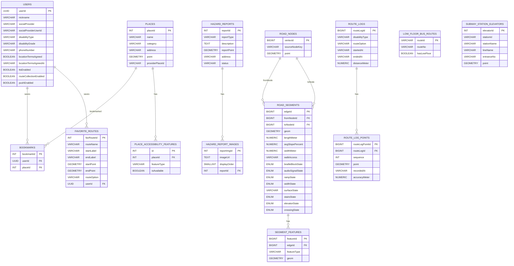

# 📋 ERD v2 — SHP 기반 보행 네트워크

> **작성일:** 2026-04-23
> **기준 문서:** `docs/erd.md` (원본 OSM 기반)
> **변경 사유:** canonical source를 `busan.osm.pbf`에서 `N3L_A0020000_26` SHP(국토교통부 도로 중심선)로 전환함에 따라 OSM 전용 source identity 컬럼을 제거하고, 보행 네트워크의 내부 식별자를 `vertexId`와 `edgeId` 중심으로 재정의
> **참조 계획:** `.ai/PLANS/current-sprint/02-shp-network-load.md`

---

## 변경 요약

| 테이블 | 제거된 컬럼 (OSM 전용) | 추가된 컬럼 (SHP 기반) |
|--------|----------------------|----------------------|
| `road_nodes` | `osmNodeId BIGINT` | `sourceNodeKey VARCHAR(100)` |
| `road_segments` | `sourceWayId`, `sourceOsmFromNodeId`, `sourceOsmToNodeId`, `segmentOrdinal` | 없음. `edgeId`를 정규 간선 PK로 사용 |
| `road_segments` UNIQUE | `(sourceWayId, sourceOsmFromNodeId, sourceOsmToNodeId, segmentOrdinal)` | 별도 source UNIQUE 없음 |

그 외 모든 테이블(`users`, `bookmarks`, `favorite_routes`, `hazard_reports`, `hazard_report_images`, `places`, `place_accessibility_features`, `segment_features`, `route_logs`, `route_log_points`, `low_floor_bus_routes`, `subway_station_elevators`)은 `docs/erd.md`와 동일하다.

---

## 1. 설계 기준

- 기준 문서: `2026-04-10 최종_프로젝트_기획서.md`, `2026-04-11_MVP_화면명세서.md`, `2026-04-09_기능명세서.md`, `2026-04-16_ACCESSIBLE_ROUTING_POC_RESTART_BLUEPRINT.md`
- `createdAt`, `updatedAt`은 JPA Auditing 기반 `BaseEntity` 공통 컬럼으로 관리하므로 테이블별 상세 명세에서는 생략한다.
- 회원 탈퇴는 물리 삭제 대신 soft delete를 기본으로 하며, 필요 시 `deletedAt`을 공통 컬럼으로 관리한다.
- 모든 컬럼 네이밍은 `camelCase`를 사용한다.
- 숫자 ID를 참조하는 외래키 컬럼은 자동 증가 컬럼이 아니므로 `SERIAL/BIGSERIAL`이 아니라 `INT/BIGINT`로 표기한다.
- PK는 테이블별 데이터 증가량 기준으로 구분한다. 대량 적재 또는 로그성 테이블은 `BIGINT`, 일반 관리성 테이블은 `INT`를 우선 검토한다.
- 사용자 식별자인 `users.userId`는 API 응답, JWT subject, FK에서 모두 UUID를 사용한다.
- 시간 데이터는 DB에 표시용 문자열 형식으로 저장하며, `VARCHAR` 컬럼에 ISO 8601 기반 문자열을 저장하는 것을 기본 원칙으로 한다.
- 변경 가능성이 있거나 운영 중 값 집합이 늘어날 수 있는 비즈니스 필드는 DB ENUM 대신 `VARCHAR`를 사용한다.
- `roadSegments`의 접근성/보행 상태처럼 라우팅 로직에서 사용하는 고정된 폐쇄 집합 값은 ENUM 사용을 허용하되, `surfaceState`처럼 분류 기준이 확장될 수 있는 필드는 `VARCHAR`를 사용한다.
- 지도/장소 검색 API는 MVP 기준 카카오 단일 사용을 전제로 한다.
- 대중교통 경로 후보는 ODsay 같은 외부 대중교통 길찾기 API를 우선 사용하고, 버스/저상버스 정보는 부산광역시_부산버스정보시스템 OpenAPI를 실시간 조회한다.

---

## 2. 도메인 구성

### 사용자 도메인

- `users`
- `bookmarks`
- `favorite_routes`
- `hazard_reports`
- `hazard_report_images`

### 장소 도메인

- `places`
- `place_accessibility_features`

### 보행 네트워크 도메인

- `road_nodes`
- `road_segments`
- `segment_features`
- `route_logs`
- `route_log_points`

### 대중교통 도메인

- `low_floor_bus_routes`
- `subway_station_elevators`
- ODsay 등 외부 대중교통 길찾기 API로 경로 후보 조회
- 부산광역시_부산버스정보시스템 OpenAPI로 버스 실시간 도착/저상버스 여부 조회
- 부산교통공사 공공데이터로 지하철 시간표/역 접근성 정보 보강
- 저상버스 예약은 백엔드 API 없이 프론트에서 부산시버스정보시스템 외부 화면 직접 연결

---

## 3. ERD 다이어그램

---

## 4. 테이블별 명세

---

## 1) users

### 역할

서비스 로그인 사용자의 계정 정보와 앱 설정 정보를 저장한다.

### 컬럼 명세

| 한글명 | 영어명 | 타입 | NULL | DEFAULT |
| --- | --- | --- | --- | --- |
| 사용자 PK | userId | UUID | NOT NULL |  |
| 닉네임 | nickname | VARCHAR(50) | NULL |  |
| 소셜 제공자 | socialProvider | VARCHAR(30) | NOT NULL |  |
| 소셜 사용자 ID | socialProviderUserId | VARCHAR(100) | NOT NULL |  |
| 장애 유형 | disabilityType | VARCHAR(30) | NULL |  |
| 장애 등급 | disabilityGrade | VARCHAR(20) | NULL |  |
| 전화번호 | phoneNumber | VARCHAR(20) | NOT NULL | 119 |
| 위치 약관 동의 여부 | locationTermsAgreed | BOOLEAN | NOT NULL | false |
| 위치 약관 동의 일시 | locationTermsAgreedAt | VARCHAR(30) | NULL |  |
| 음성 안내 여부 | ttsEnabled | BOOLEAN | NOT NULL | true |
| 경로 데이터 수집 동의 여부 | routeCollectionEnabled | BOOLEAN | NOT NULL | false |
| 푸시 알림 여부 | pushEnabled | BOOLEAN | NOT NULL | true |

### 제약

- `UNIQUE (socialProvider, socialProviderUserId)`

### 비고

- `nickname`은 실명 대신 사용하는 표시용 이름이며 중복을 허용한다.
- 최초 소셜 로그인 직후에는 프로필 입력이 완료되지 않았을 수 있으므로 `nickname`과 `disabilityType`은 `NULL`을 허용한다.
- 회원가입 완료 상태는 `nickname IS NOT NULL`이고 `disabilityType IS NOT NULL`인 경우로 판단한다.
- `disabilityType IS NULL`인 사용자는 프로필 미완료 상태이며, 서비스 핵심 기능을 이용할 수 없다.
- 회원 탈퇴는 물리 삭제 대신 soft delete를 기본으로 하며, 동일 사용자 재가입 시 기존 계정 복구 또는 재활성화 정책을 별도로 둔다.
- `userId`는 외부 응답과 JWT subject에도 사용되는 UUID다.

---

## 2) bookmarks

### 역할

사용자가 찜한 장소를 저장한다.

### 컬럼 명세

| 한글명 | 영어명 | 타입 | NULL | DEFAULT |
| --- | --- | --- | --- | --- |
| 북마크 ID | bookmarkId | INT | NOT NULL |  |
| 사용자 PK | userId | UUID | NOT NULL |  |
| 장소 ID | placeId | INT | NOT NULL |  |

### 비고

- `UNIQUE (userId, placeId)` 제약을 둔다.

---

## 3) favorite_routes

### 역할

사용자가 저장한 자주 가는 길 데이터를 관리한다.

출발지/도착지/경로 옵션을 기반으로 재탐색 가능한 입력값 저장 구조다.

### 컬럼 명세

| 한글명 | 영어명 | 타입 | NULL | DEFAULT |
| --- | --- | --- | --- | --- |
| 자주 가는 길 ID | favRouteId | INT | NOT NULL |  |
| 경로명 | routeName | VARCHAR(100) | NOT NULL |  |
| 출발지명 | startLabel | VARCHAR(255) | NOT NULL |  |
| 도착지명 | endLabel | VARCHAR(255) | NOT NULL |  |
| 출발지 좌표 | startPoint | GEOMETRY(POINT, 4326) | NOT NULL |  |
| 도착지 좌표 | endPoint | GEOMETRY(POINT, 4326) | NOT NULL |  |
| 경로 종류 | routeOption | VARCHAR(30) | NOT NULL | SAFE |
| 사용자 PK | userId | UUID | NOT NULL |  |

### routeOption 후보값

- `SAFE`
- `SHORTEST`
- `PUBLIC_TRANSPORT`

---

## 4) hazard_reports

### 역할

사용자가 등록한 도로 위험 요소 제보 데이터를 저장한다.

도로 상태 제보는 익명 제보로 처리하며 사용자 계정과 연결하지 않는다.

### 컬럼 명세

| 한글명 | 영어명 | 타입 | NULL | DEFAULT |
| --- | --- | --- | --- | --- |
| 사용자 제보 ID | reportId | INT | NOT NULL |  |
| 제보 유형 | reportType | VARCHAR(30) | NOT NULL |  |
| 설명 | description | TEXT | NULL |  |
| 제보 위치 | reportPoint | GEOMETRY(POINT, 4326) | NOT NULL |  |
| 주소 | address | VARCHAR(255) | NULL |  |
| 상태 | status | VARCHAR(30) | NOT NULL | PENDING |

### 후보값

- `reportType`: `CONSTRUCTION`, `OBSTACLE`, `DAMAGE`, `OTHER`
- `status`: `PENDING`, `APPROVED`, `REJECTED`

### 비고

- 신규 제보는 기본적으로 `PENDING` 상태로 생성한다.
- `APPROVED`, `REJECTED` 상태 변경은 Slack 제보 검토 콜백 API에서 처리한다.
- 제보 작성자 식별을 저장하지 않으므로 사용자별 제보 목록/상세/수정/삭제 기능을 제공하지 않는다.

---

## 5) hazard_report_images

### 역할

사용자 제보에 첨부된 이미지 정보를 저장한다.

이미지 파일 자체는 S3 같은 외부 스토리지에 저장하고, DB에는 URL과 순서만 관리한다.

### 컬럼 명세

| 한글명 | 영어명 | 타입 | NULL | DEFAULT |
| --- | --- | --- | --- | --- |
| 제보 이미지 ID | reportImgId | INT | NOT NULL |  |
| 이미지 URL | imageUrl | TEXT | NOT NULL |  |
| 표시 순서 | displayOrder | SMALLINT | NOT NULL | 0 |
| 사용자 제보 ID | reportId | INT | NOT NULL |  |

### 비고

- `UNIQUE (reportId, displayOrder)` 제약을 둔다.

---

## 6) places

### 역할

지도에 노출되는 장소 마스터 데이터를 저장한다.

### 컬럼 명세

| 한글명 | 영어명 | 타입 | NULL | DEFAULT |
| --- | --- | --- | --- | --- |
| 장소 ID | placeId | INT | NOT NULL |  |
| 장소명 | name | VARCHAR(255) | NOT NULL |  |
| 카테고리 | category | VARCHAR(50) | NOT NULL |  |
| 주소 | address | VARCHAR(255) | NULL |  |
| 좌표 | point | GEOMETRY(POINT, 4326) | NOT NULL |  |
| 제공자 장소 ID | providerPlaceId | VARCHAR(100) | NULL |  |

### category 후보값

- `RESTAURANT`
- `TOURIST_SPOT`
- `TOILET`
- `BUS_STATION`
- `ELEVATOR`
- `CHARGING_STATION`
- `BARRIER_FREE_FACILITY`
- `ACCOMMODATION`

### 비고

- `providerPlaceId`를 통해 내부 장소와 외부 검색 결과를 연결한다.
- `ELEVATOR`는 지도에 단독 시설 마커로 표시되는 엘리베이터 장소를 의미한다.
- `CHARGING_STATION`은 MVP 필수 시설 유형인 전동휠체어 충전소 표시를 위해 유지한다.

---

## 7) place_accessibility_features

### 역할

장소별 접근성 속성을 개별 row로 분리 저장한다.

### 컬럼 명세

| 한글명 | 영어명 | 타입 | NULL | DEFAULT |
| --- | --- | --- | --- | --- |
| 접근성 속성 ID | id | INT | NOT NULL |  |
| 장소 ID | placeId | INT | NOT NULL |  |
| 속성 유형 | featureType | VARCHAR(50) | NOT NULL |  |
| 제공 여부 | isAvailable | BOOLEAN | NOT NULL | false |

### featureType 후보값

- `ramp`
- `autoDoor`
- `elevator`
- `accessibleToilet`
- `chargingStation`
- `stepFree`

### 비고

- `UNIQUE (placeId, featureType)` 제약을 둔다.

---

## 8) road_nodes *(v2 변경)*

### 역할

보행 네트워크 그래프의 정점(Vertex)을 저장한다.

SHP 선형의 시작/종료점에서 파생된 anchor node만 관리한다. source-agnostic 설계로 OSM, SHP 등 다양한 소스를 지원한다.

### 컬럼 명세

| 한글명 | 영어명 | 타입 | NULL | DEFAULT |
| --- | --- | --- | --- | --- |
| 정점 ID | vertexId | BIGINT | NOT NULL |  |
| 소스 노드 키 | sourceNodeKey | VARCHAR(100) | NOT NULL |  |
| 노드 좌표 | point | GEOMETRY(POINT, 4326) | NOT NULL |  |

### 제약

- `UNIQUE (sourceNodeKey)`

### 비고

- `sourceNodeKey`는 endpoint 좌표를 tolerance-normalized한 결정론적 키다.
  - 생성 규칙: `f"{round(lng, 6)}:{round(lat, 6)}"` (EPSG:4326 변환 후, 0.00001° tolerance snap 적용)
  - 예시: `"129.083214:35.179032"`
- OSM 전용 `osmNodeId`는 이 버전에서 제거됐다. `vertexId`가 유일한 PK이며 `sourceNodeKey`가 natural key 역할을 한다.
- `roadSegments`의 시작/종료점으로 사용된 anchor node만 저장한다.

---

## 9) road_segments *(v2 변경)*

### 역할

보행 네트워크 그래프의 간선(Edge)을 저장한다.

보행자 경로 기준으로 설계된 테이블로, 길찾기 비용 계산·위험도 판단·지도 선형 표시의 기준이 된다. 도로 속성(차선 수, 도로명, 일방통행 등)은 보행 라우팅과 무관하므로 포함하지 않는다. canonical source는 `N3L_A0020000_26` SHP(국토교통부 도로 중심선)다.

### 컬럼 명세

| 한글명 | 영어명 | 타입 | NULL | DEFAULT |
| --- | --- | --- | --- | --- |
| 간선 ID | edgeId | BIGINT | NOT NULL |  |
| 시작 노드 ID | fromNodeId | BIGINT | NOT NULL |  |
| 종료 노드 ID | toNodeId | BIGINT | NOT NULL |  |
| 선형 좌표 | geom | GEOMETRY(LINESTRING, 4326) | NOT NULL |  |
| 길이(미터) | lengthMeter | NUMERIC(10,2) | NOT NULL |  |
| 보행 가능 상태 | walkAccess | VARCHAR(30) | NOT NULL | UNKNOWN |
| 평균 경사도(%) | avgSlopePercent | NUMERIC(6,2) | NULL |  |
| 보행 폭(미터) | widthMeter | NUMERIC(6,2) | NULL |  |
| 점자블록 상태 | brailleBlockState | ENUM | NOT NULL | UNKNOWN |
| 음향신호기 상태 | audioSignalState | ENUM | NOT NULL | UNKNOWN |
| 경사로 상태 | rampState | ENUM | NOT NULL | UNKNOWN |
| 폭 상태 | widthState | ENUM | NOT NULL | UNKNOWN |
| 노면 상태 | surfaceState | VARCHAR(30) | NOT NULL | UNKNOWN |
| 계단 상태 | stairsState | ENUM | NOT NULL | UNKNOWN |
| 엘리베이터 상태 | elevatorState | ENUM | NOT NULL | UNKNOWN |
| 횡단 상태 | crossingState | ENUM | NOT NULL | UNKNOWN |

### SHP 컬럼 매핑

- `road_segments`는 SHP의 `UFID` 같은 원천 feature 필드를 정규 컬럼으로 저장하지 않는다.
- SHP 원본 feature 식별자가 중복될 수 있으므로 이를 PK나 UNIQUE 제약으로 사용하지 않는다.
- 원본 추적이 필요하면 ETL 리포트나 적재 로그에 `edgeId -> SHP row index/UFID` 매핑을 남기고, 서비스 테이블의 정규 관계는 `edgeId`만 사용한다.

### enum 값

- `brailleBlockState`, `audioSignalState`, `rampState`, `stairsState`, `elevatorState`: `YES`, `NO`, `UNKNOWN`
- `widthState`: `ADEQUATE_150`, `ADEQUATE_120`, `NARROW`, `UNKNOWN`
- `surfaceState` 후보값: `UNKNOWN`, `PAVED`, `BLOCK`, `UNPAVED`, `OTHER`
- `crossingState`: `TRAFFIC_SIGNALS`, `NO`, `UNKNOWN`

### 제약

- `edgeId` PK
- 공간 조회용 GiST index: `geom`
- 그래프 인접 조회용 index: `(fromNodeId, toNodeId)`

### 비고

- `edgeId`가 downstream(CSV ETL, GraphHopper)에서 사용하는 유일한 PK다.
- 이번 POC에서는 `N3L_A0020000_26`을 고정 기준 네트워크로 보고 반복 재적재를 전제로 하지 않으므로, `edgeId`는 내부 간선 PK로 충분하다.
- 만약 향후 기준 SHP를 교체하거나 전체 재적재가 필요해지면, 그때는 기존 `edgeId`를 유지할 마이그레이션 전략을 별도 ADR로 정의한다.
- SHP 원본 식별자는 중복 가능성이 있으므로 정규 테이블 컬럼으로 보관하지 않는다. 필요한 경우 적재 리포트에서만 추적한다.
- `walkAccess` 기본값은 SHP 소스에서 보행 전용 의미를 확정할 수 없으므로 `UNKNOWN`으로 시작한다.
- `avgSlopePercent`, `widthMeter`는 CSV ETL(`slope_analysis_staging.csv`) 보강값으로 채워진다.
- `surfaceState`는 분류 기준이 확장될 수 있으므로 ENUM 대신 `VARCHAR`로 관리한다.
- 상세 feature 객체(음향신호기, 횡단보도 등)는 `segment_features`에 저장하고, `road_segments`에는 최종 상태값만 반영한다.

---

## 10) segment_features

### 역할

`roadSegments`에 매칭된 개별 feature 객체를 저장한다.

횡단보도, 점자블록, 음향신호기, 경사도 측정값 같은 원천 feature를 edge 단위로 추적하거나 지도에 표시할 때 사용한다.

### 컬럼 명세

| 한글명 | 영어명 | 타입 | NULL | DEFAULT |
| --- | --- | --- | --- | --- |
| feature 식별자 | featureId | BIGINT | NOT NULL |  |
| 소속 edge | edgeId | BIGINT | NOT NULL |  |
| feature 종류 | featureType | VARCHAR(50) | NOT NULL |  |
| 표시 위치/구간 | geom | GEOMETRY(GEOMETRY, 4326) | NOT NULL |  |

### 비고

- `roadSegments 1 : N segmentFeatures` 관계를 가진다.
- `geom`은 feature 성격에 따라 `POINT`, `LINESTRING` 등으로 저장할 수 있도록 범용 geometry 타입을 사용한다.
- `featureType` 예시: `CROSSWALK`, `AUDIO_SIGNAL`, `BRAILLE_BLOCK`, `CURB_RAMP`, `SUBWAY_ELEVATOR`, `SLOPE_ANALYSIS`.

---

## 11) route_logs

### 역할

내비게이션 종료 시점에 사용자가 실제 이동한 경로 로그의 메타데이터를 저장한다.

### 컬럼 명세

| 한글명 | 영어명 | 타입 | NULL | DEFAULT |
| --- | --- | --- | --- | --- |
| 경로 로그 ID | routeLogId | BIGINT | NOT NULL |  |
| 장애 유형 | disabilityType | VARCHAR(30) | NOT NULL |  |
| 경로 종류 | routeOption | VARCHAR(30) | NOT NULL | SAFE |
| 시작 시각 | startedAt | VARCHAR(30) | NOT NULL |  |
| 종료 시각 | endedAt | VARCHAR(30) | NOT NULL |  |
| 실제 이동 거리(미터) | distanceMeter | NUMERIC(10,2) | NULL |  |

### 후보값

- `disabilityType`: `VISUAL`, `MOBILITY`
- `routeOption`: `SAFE`, `SHORTEST`, `PUBLIC_TRANSPORT`

### 비고

- 사용자 또는 기기 단위 식별자를 저장하지 않는다.
- 시간 문자열은 ISO 8601 기준으로 저장한다.

---

## 12) route_log_points

### 역할

`routeLogs`에 속한 실제 이동 GPS 좌표 목록을 저장한다.

### 컬럼 명세

| 한글명 | 영어명 | 타입 | NULL | DEFAULT |
| --- | --- | --- | --- | --- |
| 경로 로그 포인트 ID | routeLogPointId | BIGINT | NOT NULL |  |
| 경로 로그 ID | routeLogId | BIGINT | NOT NULL |  |
| 좌표 순서 | sequence | INT | NOT NULL |  |
| GPS 좌표 | point | GEOMETRY(POINT, 4326) | NOT NULL |  |
| 기록 시각 | recordedAt | VARCHAR(30) | NOT NULL |  |
| GPS 정확도(미터) | accuracyMeter | NUMERIC(8,2) | NULL |  |

### 비고

- `UNIQUE (routeLogId, sequence)` 제약을 둔다.
- 시간 문자열은 ISO 8601 기준으로 저장한다.

---

## 5. 관계 명세

### users - bookmarks

- `users 1 : N bookmarks`

### users - favorite_routes

- `users 1 : N favorite_routes`

### hazard_reports - hazard_report_images

- `hazard_reports 1 : N hazard_report_images`

### places - bookmarks

- `places 1 : N bookmarks`

### places - place_accessibility_features

- `places 1 : N place_accessibility_features`

### road_nodes - road_segments

- `road_nodes 1 : N road_segments`
- 시작 노드(`fromNodeId`)와 종료 노드(`toNodeId`)를 기준으로 간선이 연결된다.

### road_segments - segment_features

- `road_segments 1 : N segment_features`
- 하나의 보행 segment는 0개 이상의 개별 feature를 가질 수 있다.

### route_logs - route_log_points

- `route_logs 1 : N route_log_points`

---

## 13) low_floor_bus_routes

### 역할

MOBILITY 사용자의 PUBLIC_TRANSPORT 경로 제공 시, 버스 노선이 저상버스를 운행하는지 사전 검증하기 위한 정적 카탈로그다.

### 컬럼 명세

| 한글명 | 영어명 | 타입 | NULL | DEFAULT |
| --- | --- | --- | --- | --- |
| 노선 ID (BIMS 기준) | routeId | VARCHAR(20) | NOT NULL |  |
| 버스 번호 | routeNo | VARCHAR(20) | NOT NULL |  |
| 저상버스 운행 여부 | hasLowFloor | BOOLEAN | NOT NULL | false |

### 제약

- `routeId` PK

### 비고

- 초기값은 부산시 저상버스 도입 현황 공공데이터로 적재하고 월 1회 이상 갱신한다.
- BIMS 실시간 도착 API의 `lowplate1`, `lowplate2` 값으로 trip 단위 override 가능하다.
- MOBILITY 경로에서 `hasLowFloor == false`이거나 테이블에 없는 노선은 PUBLIC_TRANSPORT 후보에서 즉시 탈락한다.

---

## 14) subway_station_elevators

### 역할

지하철역별 엘리베이터 입구 위치를 저장한다.

MOBILITY 사용자의 PUBLIC_TRANSPORT 경로에서 ODsay가 주는 역 중심 좌표 대신 실제 엘리베이터 입구 GPS 좌표로 WALK leg를 재계산하는 데 사용한다.

### 컬럼 명세

| 한글명 | 영어명 | 타입 | NULL | DEFAULT |
| --- | --- | --- | --- | --- |
| 엘리베이터 ID | elevatorId | INT | NOT NULL |  |
| 역 식별자 (부산교통공사 기준) | stationId | VARCHAR(20) | NOT NULL |  |
| 역명 | stationName | VARCHAR(100) | NOT NULL |  |
| 호선명 | lineName | VARCHAR(50) | NOT NULL |  |
| 출입구 번호 | entranceNo | VARCHAR(10) | NULL |  |
| 엘리베이터 위치 좌표 | point | GEOMETRY(POINT, 4326) | NOT NULL |  |

### 제약

- `elevatorId` PK
- `INDEX (stationId)`

### 비고

- 하나의 역에 여러 레코드가 존재할 수 있다 (출입구별).
- WALK leg 목적지 override 시 `stationId`로 조회 후 ODsay가 준 WALK leg 종점과 가장 가까운 엘리베이터를 선택한다.
- 환승역의 경우 환승 동선 엘리베이터도 동일 테이블에 `entranceNo`로 구분하여 저장한다.
- 초기값은 한국승강기안전공단 공공데이터와 부산교통공사 역 시설 현황을 기반으로 적재한다.

### 관계

- `subway_station_elevators N : 1 station` (`stationId` 기준, 별도 station 테이블 없이 `stationId`로 grouping)
